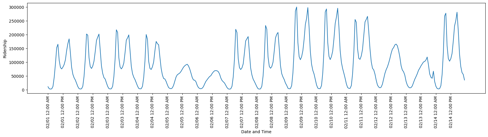

# Subway Science: Forecasting New York City's hourly subway ridership with machine learning

By Nick Haubrich and Jack Carlisle 

## Overview

With over 400 stations and up to millions of daily riders, the New York City subway system is one of the largest and busiest services of its kind. For many residents, the subway system is their primary means of transportation. The Metropolitan Transit Authority (MTA) has periodically released data on the subway's ridership as part of its Open Data Program. In this project, we implement machine learning techniques to model and forecast the hourly ridership of the NYC subway on short and medium timescales.

Predictions of this kind are valuable for a variety of purposes. For instance, users with access to such predictions could adjust their travel schedule so that they do not use a particular station when that station is experiencing excess ridership. This could improve the overall efficiency and usability of the subway system. Moreover, these predictive models could inform the MTA of which stations may be over- or under-utilized. This is valuable information which can inform decisions regarding resource allocation in both the short-term and long-term.

## Environment Setup
We recommend a python virtual environment:
```
python3.11 -m venv venv/
. venv/bin/activate
pip install -r requirements.txt
```
For convenience, the notebooks download the preprocessed data (~30 MB) from a hosted source.

## Dataset
Our dataset consists of hourly ridership at each of the 428 MTA stations from February 2022 to October 2024, and was obtained from [data.ny.gov](https://data.ny.gov/Transportation/MTA-Subway-Hourly-Ridership-Beginning-July-2020/wujg-7c2s/about_data). By summing the hourly ridership from each station, we also have access to the hourly total ridership. The hourly total ridership for two weeks is shown below. 



By plotting the hourly total ridership, we clearly see some periodic behavior, corresponding to the time of day, day of the week, etc. Our machine learning models will be able to learn these periodic behaviors, and use them to make accurate forecasting predictions.

## Data Preprocessing
We begin by converting our dataset into an array with each row corresponding to an hour, with ridership for each station. Further details on this process can be found in `scripts/README.md`. Altogether, we have 23349 hours of observations, with ridership for each of the 428 stations. The data was split into training, validation, and testing set, consisting of 70%, 10%, and 20% of our time interval, respectively. 

Next, we perform some feature engineering so we may provide our models with as much valuable data as we can. This process includes:

- Normalizing the ridership data by scaling the ridership to mean 0 and variance 1.
- Encoding time of day, day of week, day of month, and month of year as "Fourier variables". This is a way of encoding, for example, each day of the week as a pair of numbers, so that nearby days (e.g. Sunday and Monday) have nearby encodings.
- Including a flag (1 or 0) for US holidays, which was accomplished using python's holiday library. This is valuable since subway ridership on major Holidays (e.g. Christmas, Thanksgiving) behaves much differently than it does on a typical day. 

## Machine Learning Forecasting
Our next task is to build and train our machine learning models. We undertake two main tasks: predicting total subway ridership, and then, predicting per-station subway ridership. Both are handled with an autoregressive approach: each model predicts future observations based on the past several observations plus external features (such as time of day, month of year, etc.).

We evaluate the performance of models on our testing set using the root mean square error. Our model is build to predict one hour of ridership in advance. We can also predict multiple hours into the future by feeding our models predictions back into the model as inputs.

### Forecasting Total Subway Ridership
For forecasting the total ridership, three model architectures were considered:

 - Linear Model (Linear)
 - Dense Neural Network (NN)
 - Long Short-Term Memory Network (LSTM)

Hyperparameters for the deep networks were varied to obtain the local maximum in performance. Both the LSTM and NN achieve satisfactory results. Below, extrapolated predictions for a sample week are shown.


The models were evaluated on the RMSE of predictions up to 24 hours in advance over a 20% testing dataset. The LSTM narrowly outperforms the NN over the range of forecast times.


### Forecasting Per-Station Subway Ridership
A per-station model outputs a prediction of ridership for each of the 428 MTA stations. Since such a model produces 428 outputs instead of a single output, this results in a substantial increase in computational burden. Simply feeding all station information into deep networks proved ineffective, as the increase in input variables led to overfitting and unstable extrapolations. The first attempts along these lines with LSTM, dense networks, and a linear model performed poorly. Instead, a dense neural network that acted on each station individually was trained, and implemented as a 1-dimensional convolutional neural network (CNN). Station identifiers are encoded by unique 16-dimensional vectors supplied as additional features. 

Metrics of the CNN evaluated on the test dataset are show below. The CNN's total RMSE across stations for the first predicted hour is 5.4, increasing to 22.5 for the twelfth hour (upper left). The summed RMSE for each station over the 12 hour predictions is below 2 in most cases, with several outliers above 4 (upper right). The predictions of these stations deviates most at the final hour, as show in the plot of RMSE at each hour and station (lower).


As a visualization, the CNN's predictions and the true values over a sample 4-day period are projected according to the station's coordinates onto a map of NYC.


# Conclusions and future directions

In conclusion, we have implemented a LSTM neural network which accurately predicts total MTA ridership given information about past ridership. Moreover, we implemented a 1-dimensional CNN which accurately predicts per-station MTA ridership given information about past ridership. These models provide information which may be useful for MTA riders regarding use of the subway system, and for MTA decision regarding resource allocation, and future project development. 

The performance of our models was worst for the stations servicing Citi Field, Yankee Stadium, and Rockaway beach. These three locations are subject to irregular surges in ridership (due to MLB games or nice weather). Further feature engineering may improve the model. Incorporating the home schedule of games and weather predictions (e.g. temperature and precipitation) may substantially improve the model's accuracy for these stations.

Finally, there may be room for further architecture improvements. As the LSTM performed the best for the total ridership case, it is expected that training a LSTM on each station individually would perform as well or better than the CNN. However, this is computationally taxing. It may be possible to incorporate RNN elements into the CNN to obtain a favorable tradeoff of accuracy and computation.


